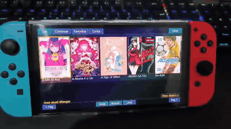
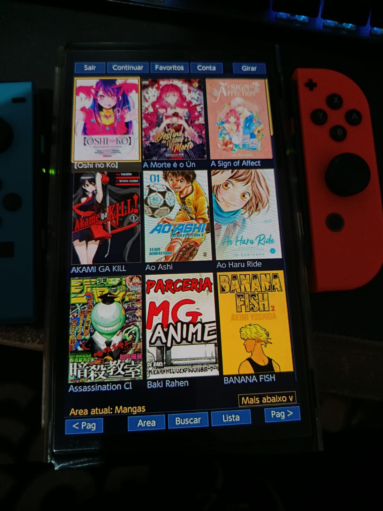
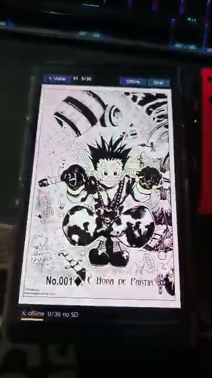
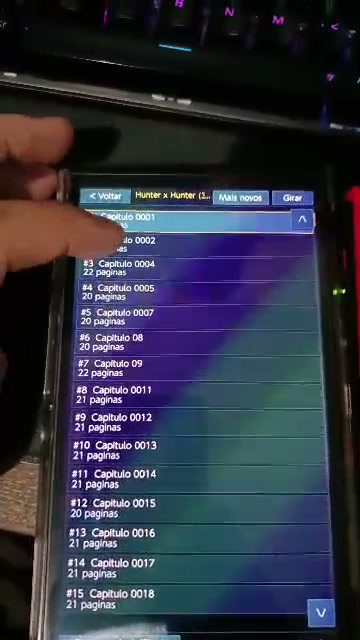
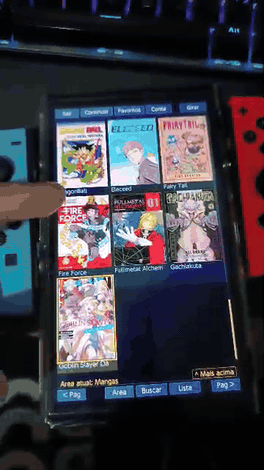

# Meruem Switch

Meruem Switch e o app homebrew do Meruem para Nintendo Switch. Ele permite ler
mangas, HQs e livros da plataforma Meruem diretamente no console, com login,
favoritos, continuar lendo, leitura offline/local, zoom por toque e
atualizacoes pelo proprio app.

O objetivo e simples: levar a experiencia do Meruem para o Switch de forma
pratica, leve e acessivel.

> O app nao e distribuido pela Nintendo e nao esta na eShop. Ele e um homebrew
> em formato `.nro` e precisa de um Switch preparado para abrir o Homebrew Menu.

## Demonstracao

<p align="center">
  
  <br><sub>Catalogo no modo TV (dock).</sub>
</p>

<p align="center">
  
  
  
  <br><sub>Catalogo (portatil) &middot; leitor &middot; lista de capitulos.</sub>
</p>

<p align="center">
  
  <br><sub>Navegacao pelo catalogo no modo portatil.</sub>
</p>

## Para Usuarios

Baixe a versao mais recente em:

[Releases do Meruem Switch](https://github.com/Tonsoaresmt/meruem-switch/releases/latest)

Arquivo necessario:

```text
Meruem.nro
```

Instalacao resumida:

1. Baixe `Meruem.nro`.
2. Copie para o SD em `sdmc:/switch/Meruem/Meruem.nro`.
3. Abra o Homebrew Menu no Switch.
4. Inicie o Meruem.
5. Entre com sua conta Meruem para areas online, ou use Offline/Local para ler
   arquivos ja salvos no SD.

Guia completo: [docs/INSTALL.md](docs/INSTALL.md)

Leitura de arquivos proprios no SD: [docs/LOCAL.md](docs/LOCAL.md)

## Acesso e Assinatura

O Meruem Switch usa a conta da plataforma Meruem. Usuarios gratuitos podem ter
limites diarios de leitura. Para leitura sem limite, e necessario ter uma
assinatura ativa do Meruem.

O plano de entrada parte de **R$ 6,90 por 3 meses** para liberar leitura sem
limite na area escolhida, conforme os planos disponiveis na plataforma.

Esse valor e mantido baixo de proposito: a ideia e deixar o projeto acessivel
para mais leitores e, ao mesmo tempo, ajudar a manter a plataforma, o
armazenamento, o trafego, as melhorias e a manutencao continua do Meruem online.

Os valores e areas liberadas podem mudar conforme os planos ativos no site. Em
caso de duvida, consulte a tela de planos dentro do Meruem.

## Recursos

- Catalogo de mangas, HQs e livros.
- Login com conta Meruem.
- Favoritos e prateleira sincronizados.
- Continuar lendo.
- Area Baixados para capitulos do Meruem salvos no SD.
- Area Local para CBZ e pastas de imagens do proprio usuario no SD.
- Area Livros para baixar e ler PDF/EPUB do Meruem no SD do Switch.
- Pasta local `sdmc:/Livros` para PDF/EPUB do proprio usuario no dispositivo.
- Ultima area usada lembrada ao reabrir o app.
- Catalogo online com variacao de pagina inicial para descobrir obras novas.
- Modo capas e modo lista.
- Ordem de capitulos: mais antigos ou mais novos primeiro.
- Leitura por controle ou touch.
- Toque lateral para avancar/voltar pagina.
- Zoom por pinca.
- Arraste para mover imagem com zoom.
- Proximo capitulo automatico.
- Atualizacao do `.nro` pelo proprio app.

## Formatos Suportados

O Meruem Switch foi feito para conteudo entregue como paginas de imagem e,
na area Livros, tambem abre PDF/EPUB vindos do Meruem.

Suportado:

- CBZ;
- CBR, quando disponivel como paginas de imagem;
- mangas e HQs compativeis com leitura por paginas;
- Manhwa/Webtoon em tiras verticais dentro de `.cbz` ou pastas de imagens;
- PDF/EPUB online pela area Livros;
- CBZ local direto do SD;
- PDF/EPUB local direto do SD pela area Local;
- pastas locais com imagens `.jpg`, `.jpeg`, `.png`, `.webp` ou `.bmp`.

Nao suportado no app do Switch por enquanto:

- livros de texto;
- CBR local aberto direto do SD.

Para livros do proprio usuario, coloque PDF/EPUB em `sdmc:/Livros` ou escolha
uma pasta local em Conta.

## Controles Principais

Catalogo:

- `A`: abrir obra/capitulo;
- `X`: alternar entre capas e lista; quando ha busca ativa, limpa a busca;
- `Y`: trocar area;
- `L/R`: pagina anterior/proxima;
- `B`: voltar ou ir para continuar lendo.

Leitor:

- `A` ou toque na direita: proxima pagina;
- toque na esquerda: pagina anterior;
- `L/R`: trocar pagina;
- pinca com dois dedos: zoom;
- arrastar com um dedo: mover imagem quando esta com zoom;
- `B`: voltar;
- `Y`: em PDF/EPUB, alterna tamanho do texto/zoom;
- `ZL/ZR`: girar tela.

## Atualizacoes

Quando uma nova versao e publicada no GitHub Releases, o app pode avisar no boot
e baixar o novo `Meruem.nro` automaticamente.

Se preferir atualizar manualmente, baixe a release mais recente e substitua o
arquivo no SD.

Mais detalhes: [docs/UPDATES.md](docs/UPDATES.md)

## Changelog

Historico de versoes em [CHANGELOG.md](CHANGELOG.md). A versao mais recente fica
sempre em [Releases](https://github.com/Tonsoaresmt/meruem-switch/releases/latest).

## Aviso

Este projeto e independente e nao possui afiliacao com Nintendo, Komga ou outros
servicos de terceiros. Use apenas com conteudo que voce tem direito de acessar.
